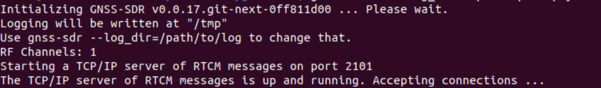
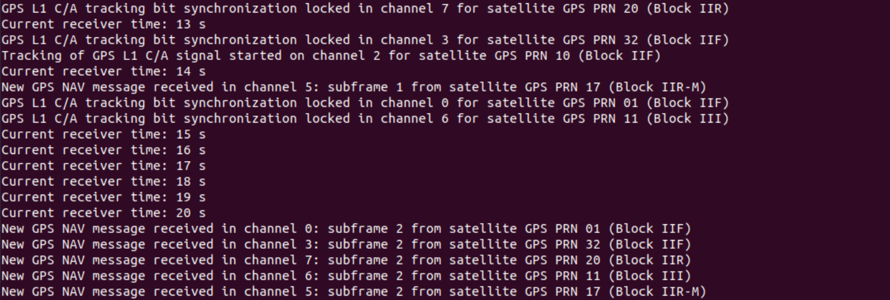
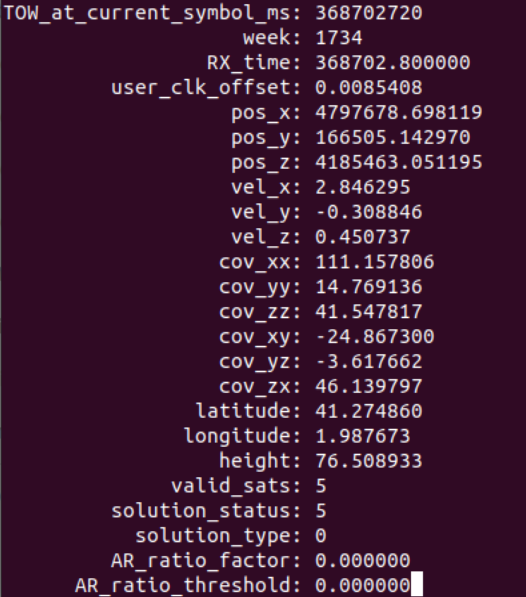

GNSS-SDR with LimeSDR 
===============

.. contents:: Table of Contents
   :depth: 1
   :local:

.. note::

  Keep in mind that the installationg and use of the gnss-sdr with the LimeSDR has only been tested on Ubuntu 20.04 LTS.

GNSS SDR
---------

The full installation procedure of the GNSS SDR explained at `gnss-sdr.org <https://gnss-sdr.org/build-and-install>`_

Install the dependencies

.. code-block:: bash

   sudo apt-get install build-essential cmake git pkg-config libboost-dev libboost-date-time-dev libboost-system-dev \
   libboost-filesystem-dev  libboost-thread-dev libboost-chrono-dev libboost-serialization-dev libboost-program-options-dev \
   libboost-test-dev liblog4cpp5-dev libuhd-dev gnuradio-dev gr-osmosdr libblas-dev liblapack-dev libarmadillo-dev libgflags-dev \
   libgoogle-glog-dev libhdf5-dev libgnutls-openssl-dev libmatio-dev libpugixml-dev libpcap-dev libprotobuf-dev protobuf-compiler \
   libgtest-dev googletest python-mako python-six

Install GNSS-SDR     

.. code-block:: bash

   git clone https://github.com/gnss-sdr/gnss-sdr  
   cd gnss-sdr/build  
   git checkout next  
   cmake ..  
   make  
   sudo make install

Performance Boost 
^^^^^^^^^

.. note::

  Allows the use of SIMD instructions

.. warning::

  Only run this once
      
.. code-block:: bash

   volk_profile  
   volk_gnsssdr_profile  

LimeSDR for GNSS-SDR
--------- 

SoapySDR and Limesuite
^^^^^^^^^

Installation of LimeSDR and Limesuite explained at `myriadrf <https://wiki.myriadrf.org/Installing_Lime_Suite_on_Linux>`_ 

.. code-block:: bash

   sudo add-apt-repository -y ppa:myriadrf/drivers  
   sudo apt-get update  
   sudo apt-get install limesuite liblimesuite-dev limesuite-udev limesuite-images  
   sudo apt-get install soapysdr-tools soapysdr-module-lms7

LimeSDR module for GNSS-SDR
^^^^^^^^^

Installation of LimeSDR for GNSS SDR explained at `gnss-sdr.org <https://gnss-sdr.org/docs/sp-blocks/signal-source/#implementation-limesdr_signal_source>`_ 

.. code-block:: bash

   cd  
   sudo apt-get install gr-limesdr  
   cd gnss-sdr/build  
   git checkout next  
   git pull upstream next  
   cmake -DENABLE_LIMESDR=ON ..  
   make && sudo make install  

Monitoring blocks (PVT monitoring and GNSS Synchro)
---------

GNSS Synchro
^^^^^^^^^

Installation of the GNSS Synchro monitoring block explained at : `gnss-sdr.org <https://gnss-sdr.org/docs/sp-blocks/monitor/>`_  

Install dependencies

.. code-block:: bash

   sudo apt-get install build-essential cmake libboost-dev libboost-system-dev libprotobuf-dev protobuf-compiler libncurses5-dev libncursesw5-dev wget  
       
Create a monitoring-client folder and download the required files 

.. code-block:: bash

    mkdir monitoring-client  
    cd monitoring-client  
    wget https://raw.githubusercontent.com/torejohansson97/tightly-coupled-gnss-data-logger/main/monitoring-client/gnss_synchro_udp_source.h  
    wget https://raw.githubusercontent.com/torejohansson97/tightly-coupled-gnss-data-logger/main/monitoring-client/gnss_synchro_udp_source.cc
    wget https://raw.githubusercontent.com/torejohansson97/tightly-coupled-gnss-data-logger/main/monitoring-client/main.cc
    wget https://raw.githubusercontent.com/torejohansson97/tightly-coupled-gnss-data-logger/main/monitoring-client/CMakeLists.txt
    wget https://raw.githubusercontent.com/torejohansson97/tightly-coupled-gnss-data-logger/main/monitoring-client/gnss_synchro.proto
    mkdir build
    cd build  
    cmake ../  
    make  

PVT Monitoring
^^^^^^^^^

PVT monitoring block explained by : `acebrianjuan <https://github.com/acebrianjuan/gnss-sdr-pvt-monitoring-client>`_  

.. code-block:: bash

   cd
   git clone https://github.com/acebrianjuan/gnss-sdr-pvt-monitoring-client.git
   cd gnss-sdr-pvt-monitoring-client/build  
   cmake ../  
   make  

Configuration file for acquisition
---------

Create a working directory for GNSS SDR

.. code-block:: bash
      cd
      cd gnss-sdr/build
      mkdir work
      
Download the configuration file for live acquisition with limesdr

.. code-block:: bash

      wget https://raw.githubusercontent.com/torejohansson97/tightly-coupled-gnss-data-logger/main/GNSS-SDR/limeSDR.conf
      
Or download the configuration file to replay acquisition with a file of raw data, like explained in here : `gnss-sdr.org <https://gnss-sdr.org/my-first-fix/>`_

.. code-block:: bash

      wget https://raw.githubusercontent.com/torejohansson97/tightly-coupled-gnss-data-logger/main/GNSS-SDR/Filedump.conf
      wget https://sourceforge.net/projects/gnss-sdr/files/data/2013_04_04_GNSS_SIGNAL_at_CTTC_SPAIN.tar.gz
      tar -zxvf 2013_04_04_GNSS_SIGNAL_at_CTTC_SPAIN.tar.gz
      
.. warning::

      The path to the raw data file is labeled as "SignalSource.filename=" in the configuration file. Be careful when you extract the file, the path to the .dat file         may be "/2013_04_04_GNSS_SIGNAL_at_CTTC_SPAIN/2013_04_04_GNSS_SIGNAL_at_CTTC_SPAIN.dat"

How to launch the GNSS SDR
---------

.. code-block:: bash
      
      cd
      cd gnss-sdr
      gnss-sdr --config-file=./build/work/Name_of_configfile.conf

If you want to stream real time data using an antenna and limesdr use the configuration file limeSDR.conf

If you want to replay data which was already recorded in a file use the configuration file filedump.conf

You should see something similar to:

And after a few seconds of detecting the GPS signals you should start getting new navigation messages:

If you need more explanation on how to make GNSS SDR work go to https://gnss-sdr.org/my-first-fix/

How to launch PVT Monitoring client
---------

Open new terminal and go to /gnss-sdr-pvt-monitoring-client/build

.. code-block:: bash

      cd
      cd gnss-sdr-pvt-monitoring-client/build
      ./gnss-sdr-pvt-monitoring-client 1111 

1111 being the pvt monitoring port defined in the configuration file

After a few seconds of running the gnss-sdr you should start getting information about the satellites which are detected:

.. image:: ../../images/gnsssynchro.png

How to launch GNSS Synchro monitoring client
---------

Open new terminal and go to /monitoring-client/build

.. code-block:: bash

      cd
      cd monitoring-client/build
      ./monitoring-client 1234
      
1234 being the GNSS Synchro port defined in the configuration file      

After a few seconds of running the gnss-sdr you should start getting position fixes which will lead to this kind of data:

