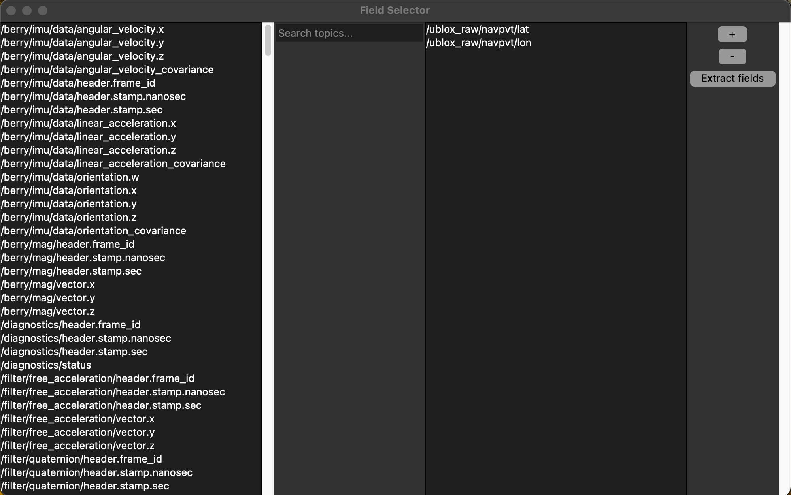

Extract Data
===============

Once a recording as been made, the data can be extracted from the output SQL database
using the extract_data.py script. This script will extract the data from the database
and save it in a CSV file. The CSV file can then be used for further analysis.

The script can be run as follows:

.. code-block:: bash
    
    extract-database -i NAME_OF_RECORDING -o OUTPUT_FILE

Where NAME_OF_RECORDING is the folder enclosing the database file (not the .db3 file itself).

The script opens up a GUI like this:

The tool allows the user to selct the field they wish to extract from the database by following these steps:

1. Select the message type from left hand side column (use the search bar to filter the list).

2. Click the + button to add the message type to the right hand side column.

3. Once the user as selected all the field they wish to extract, click the "Extract fields" button.

4. The user will be prompted to select a folder to save the CSV file to.

5. The CSV file will be saved to the selected folder.

.. thumbnail:: ../../images/field_extractor_tool_instruction.png
    :group: field_extractor_tool
    :width: 600px
    :align: center
    :alt: Field Extractor Tool (Instructions)